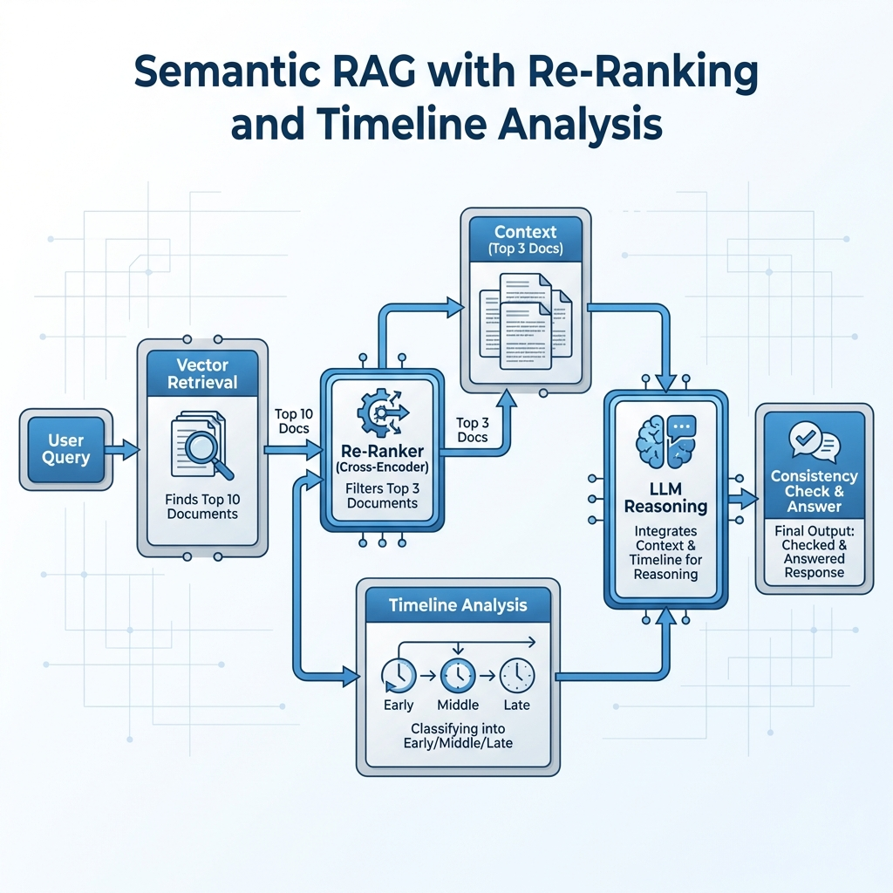

<div align="center">

# 🧠 Semantic RAG with Re-Ranking and Timeline Analysis

[](https://www.python.org/)
[](https://jupyter.org/try)
[](https://opensource.org/licenses/MIT)

*A sophisticated Retrieval-Augmented Generation (RAG) system incorporating semantic search, cross-encoder re-ranking, and temporal context analysis.*

</div>

---

## 📖 Description



This project demonstrates a next-generation RAG pipeline that moves beyond simple vector retrieval. It integrates three key pillars for enhanced reasoning:

-   **🔎 Semantic Search**: Leveraging high-dimensional vector embeddings to pinpoint relevant content.
-   **📶 Re-Ranking**: Utilizing a cross-encoder to refine and prioritize the top results for maximum relevance.
-   **⏳ Timeline Analysis**: extracting and structuring temporal information to understand the sequence of events.

The core logic and implementation are encapsulated within the `DosOs_Final_Code.ipynb` notebook.

---

## 🚀 Installation

1.  **Clone the repository:**
    ```bash
    git clone https://github.com/shreyanshxt/Semantic-RAG-With-ReRanking-Timeline-Analysis.git
    cd Semantic-RAG-With-ReRanking-Timeline-Analysis
    ```

2.  **Install dependencies:**
    ```bash
    pip install -r requirements.txt
    ```

---

## 🛠️ Usage

1.  **Launch Jupyter Notebook:**
    ```bash
    jupyter notebook
    ```

2.  **Open & Run:**
    Open `DosOs_Final_Code.ipynb` and execute the cells to observe the pipeline in action.

---

## 📦 Dependencies

The project relies on a robust stack of NLP and data libraries:

| Library | Purpose |
| :--- | :--- |
| `transformers` | LLM and Tokenizer access |
| `sentence-transformers` | generating semantic embeddings |
| `faiss-cpu` | Efficient vector similarity search |
| `torch` | Deep learning backend |
| `pandas` | Data manipulation and analysis |
| `numpy` | Numerical computing |

---

## 📊 Performance & Models

### 🧠 Model Architecture

| Component | Model Name | Description |
| :--- | :--- | :--- |
| **Re-Ranker** | `cross-encoder/ms-marco-MiniLM-L-6-v2` | Refines retrieval results for higher precision. |
| **Embeddings** | `all-MiniLM-L6-v2` | Creates dense vector representations of text. |

### 📉 Dataset & Accuracy

| Metric | Value |
| :--- | :--- |
| **Train Set** | `train.csv` (80 samples) |
| **Test Set** | `test.csv` |
| **Final Accuracy** | **66.2%** |

---

<div align="center">
    <p><i>Built with ❤️ for advanced RAG research.</i></p>
</div>
